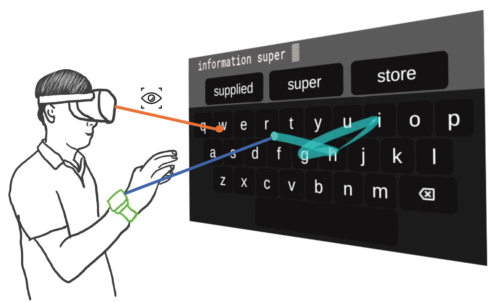

# Gaze Speedup: Eye Gaze Assisted Gesture Typing in Virtual Reality
Maozheng Zhao, Alec M Pierce, Ran Tan, Ting Zhang, Tianyi Wang, Tanya R. Jonker, Hrvoje Benko, Aakar Gupta
Stony Brook University, Meta 

## Presentation Video (8 minutes)

<iframe width="560" height="315" src="//player.bilibili.com/player.html?aid=682611771&bvid=BV1AU4y1o7CM&cid=558101415&page=1" scrolling="no" border="0" title="EyeSayCorrect presentation video" frameborder="no" framespacing="0" allowfullscreen="true"> </iframe>

The video is also available on [Youtube](https://youtu.be/cSYQwaqchl0) and [Bilibili](https://www.bilibili.com/video/BV1AU4y1o7CM?share_source=copy_web).

## Video Demo (2 minutes)

<iframe width="560" height="315" src="//player.bilibili.com/player.html?bvid=BV1244y1W7jt&page=1&high_quality=1" scrolling="no" border="0" title="EyeSayCorrect Demo" frameborder="no" framespacing="0" allowfullscreen="true"> </iframe>

<iframe src="//player.bilibili.com/player.html?aid=909813230&bvid=BV1XM4y117cL&cid=1089164072&page=1" scrolling="no" border="0" frameborder="no" framespacing="0" allowfullscreen="true"> </iframe>

The video is also available on [Youtube](https://youtu.be/MxVBq2SDC_k) and [Bilibili](https://www.bilibili.com/video/BV1244y1W7jt?spm_id_from=333.999.0.0).

## Abstract
Mid-air text input in augmented or virtual reality (AR/VR) is an open problem. One proposed solution is gesture typing where the user performs a gesture trace over the keyboard. However, this requires the user to move their hands precisely and continuously, potentially causing arm fatigue. With eye tracking available on AR/VR devices, multiple works have proposed gaze-driven gesture typing techniques. However, such techniques require the explicit use of gaze which are prone to Midas touch problems, conflicting with other gaze activities in the same moment. In this work, the user is not made aware that their gaze is being used to improve the interaction, making the use of gaze completely implicit. We observed that a user’s implicit gaze fixation location during gesture typing is usually the gesture cursor’s target location if the gesture cursor is moving toward it. Based on this observation, we propose the Speedup method in which we speed up the gesture cursor toward the user’s gaze fixation location, the speedup rate depends on how well the gesture cursor’s moving direction aligns with the gaze fixation. To reduce the overshooting near the target in the Speedup method, we further proposed the Gaussian Speedup method in which the speedup rate is dynamically reduced with a Gaussian function when the gesture cursor gets nearer to the gaze fixation. Using a wrist IMU as input, a 12-person study demonstrated that the Speedup method and Gaussian Speedup method reduced users’ hand movement by and respectively without any loss of typing speed or accuracy.

## Publication 

Maozheng Zhao, Alec M Pierce, Ran Tan, Ting Zhang, Tianyi Wang, Tanya R. Jonker, Hrvoje Benko, and Aakar Gupta. 2023. Gaze Speedup: Eye Gaze Assisted Gesture Typing in Virtual Reality. In Proceedings of the 28th International Conference on Intelligent User Interfaces (IUI '23). Association for Computing Machinery, New York, NY, USA, 595–606. https://doi.org/10.1145/3581641.3584072 
(gs.pdf)

## Contact
For questions and further information, please contact: 
Maozheng Zhao 
Email: maozheng.zhao@stonybrook.edu
